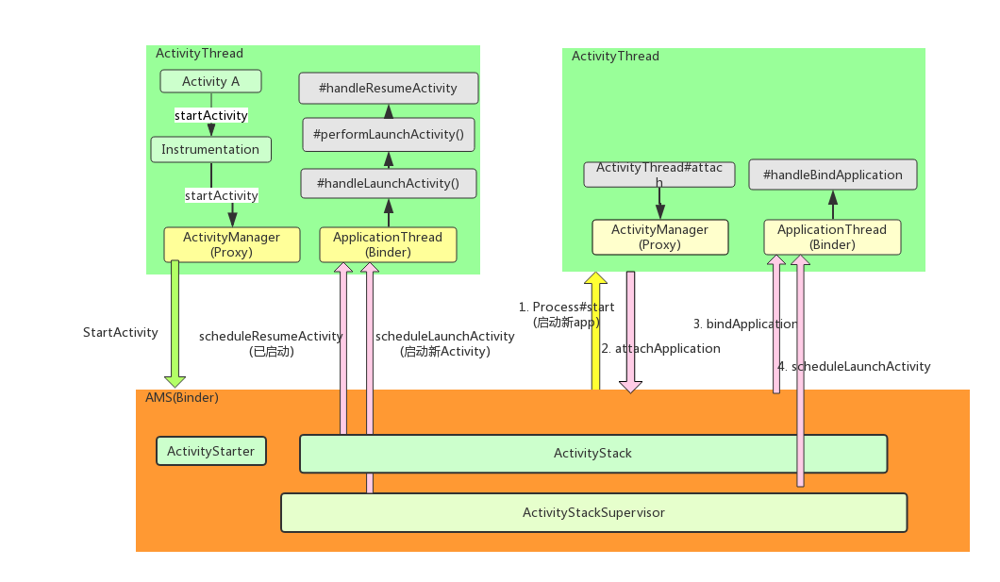
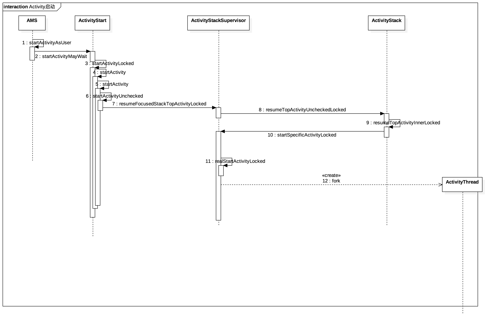
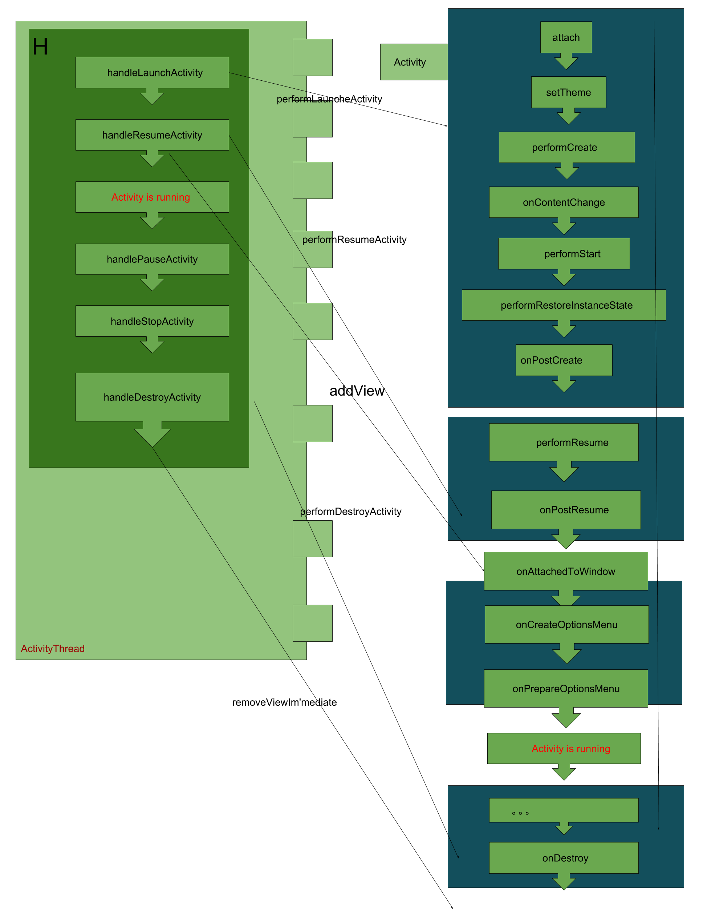
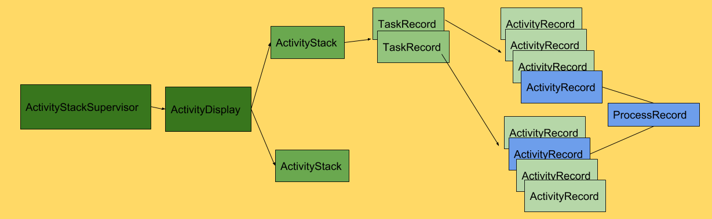
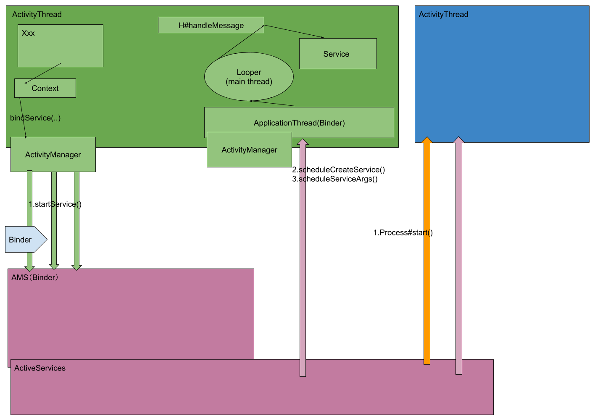
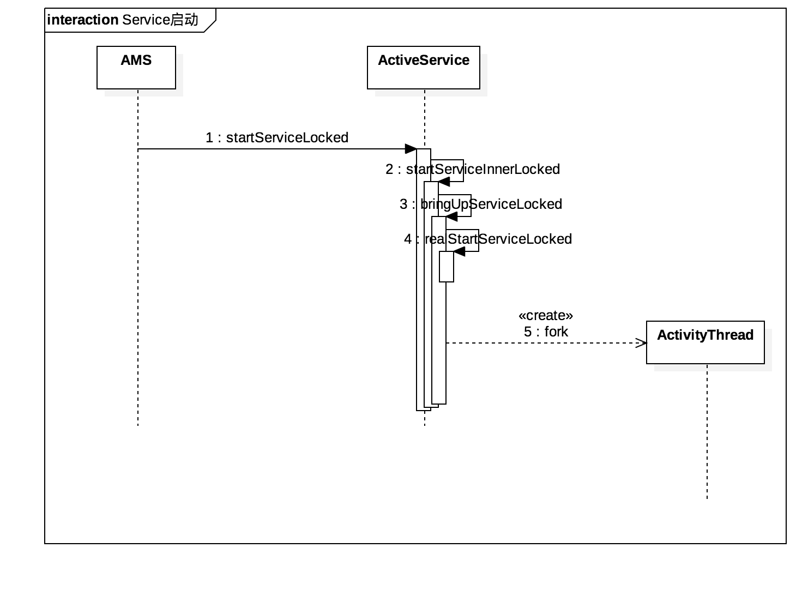
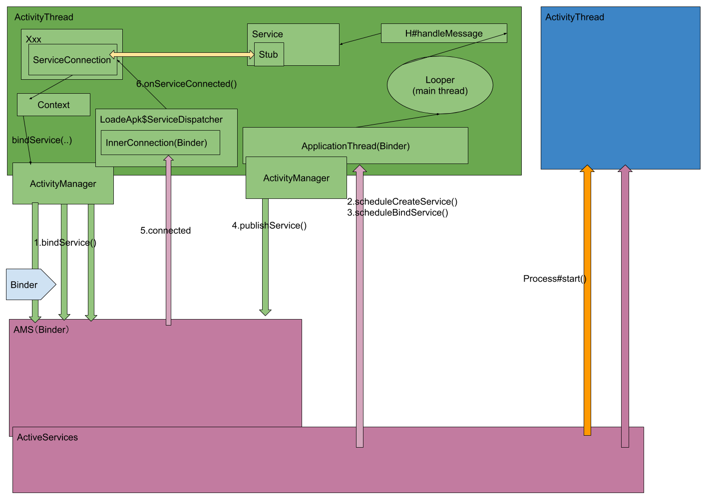
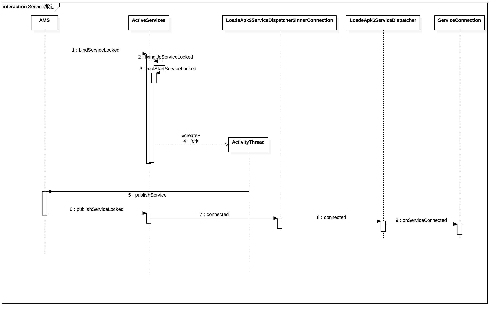

# MAS及四大组件

## 目录

## Activity

启动流程：

1. launcher通过startActivity开启一个新应用
2. 调用Instrumentation#startActivity
3. 调用ActivityManager代理远程调用AMS方法

4. 经过ActivityStart / ActivityStackSupervisor / ActivityStack，最后调用ActivityStackSupervisor#startSpecificActivityLocked方法
5. 该方法会做判断，如果是打开新app转6，否则转11
6. AMS创建新进程，使用Socket通知Zygote进程fork出一个进程，用来承载即将启动的Activity，指定main函数的类为ActivityThread
7. main函数中开启Looper，并执行ActivityThread#attach
8. 继续跨进程调用AMS#attachApplication
9. AMS根据进程记录将传递给ApplicationThread#bindApplication详见10，然后再调用mStackSupervisor#attachApplicationLocked启动activiy，详见11
10. 转到主线程，创建Context、Instrumentation、application，并调用application#oncreate
11. 调用ApplicationThread#scheduleLaunchActivity，之后切回本地进程
12. 在ActivityThread#handleLaunchActivity中依次调用performLaunchActivity，handleResumeActivity。
13. performLaunchActivity中首先创建activity，然后依次调用Activity的attach()->setTheme()->performCreate()->performStart()->performRestoreInstanceState()->onPostCreate()
14. 在handleResumeActivity中performResume()->onPostResume()->WindowManager#addView()

### 说明
ActivityStarter：决定了intent和flag如何打开Activity和关联task、stack

ActivityStack：管理者Activity

ActivityStack管理Activity生命周期相关的几个方法。

startActivityLocked()
resumeTopActivityLocked()
completeResumeLocked()
startPausingLocked()
completePauseLocked()
stopActivityLocked()
activityPausedLocked()
finishActivityLocked()
activityDestroyedLocked()
ActivityStackSupervisor：由于多屏功能的出现，就需要ActivityStackSupervisor这么一个类来管理ActivityStack。

## Service

### startService

1. 通过ContextImpl发起startService操作，之后跨进程调用AMS的startService方法
2. 在ActiveService#realStartServiceLocked中跨进程调用ApplicationThread#scheduleCreateService(详见3)，再调用ApplicationThread#scheduleServiceArgs(详见4)
3. ApplicationThread#scheduleCreateService：切换到主线程，构造出service, ContextImpl, 执行Service#attach，Service#onCreate
4. ApplicationThread#scheduleServiceArgs：切换到主线程，调用Service#onStartCommand

### bindService

1. 通过ContextImpl发起bindService操作，由于涉及到跨进程调用，因此把ServiceConnection对象封装成IBinder类型的InnerConnection对象。
2. 跨进程调用AMS#bindService，然后和startService类似，交给ActiveService实际操作。
3. 在ActiveService#bindServiceLocked中会调用ApplicationThread#scheduleCareteService和ApplicationThread#scheduleBindService。前一个方法与startService类似
4. ActivityThread切换到主线程，然后再跨进程调用AMS#publishService
5. AMS仍旧交给ActiveService执行publishServiceLocked()，然后会调用第1步中构造的InnerConnection#connect
6. InnerConnection是能拿到最初的ServiceConnection对象的，因此只需要切换到主线程并调用ServiceConnection#onServiceConnected即可。

## BroadcastReceiver
广播的工作流程主要分为两方面，一是广播的注册，二是广播的发送与接收。
注册又分为动态注册和静态注册，静态注册写在manifest中，由PMS完成注册，而动态注册是在代码中完成，这里只分析动态注册。
### 注册广播(动态注册)
1. 通过ContextImpl发起registerReceiver操作，然后与service绑定过程类似，将receiver封装成一个用于跨进程通信的IBinder(IIntentReceiver)，然后调用AMS#registerReceiver
2. AMS中的核心是将IntentReceiver作为key，ReceiverList（DeathRecipient子类）作为value保存到一个map中。最后把该ReceiverList和IntentFilter封装成BroadcastFilter并加入mReceiverResolver中。
### 发送广播
1. 由ContextImpl发起sendBroadcast操作，跨进程调用AMS#broadcastIntent
2. 将信息封装成BroadcastRecord然后加入BroadQueue中，并调用BroadcastQueue#scheduleBroadcastsLocked
3. BroadCastQueue中先切换到主线程（AMS的主线程），然后取出所有所有普通广播的Record
3. 
