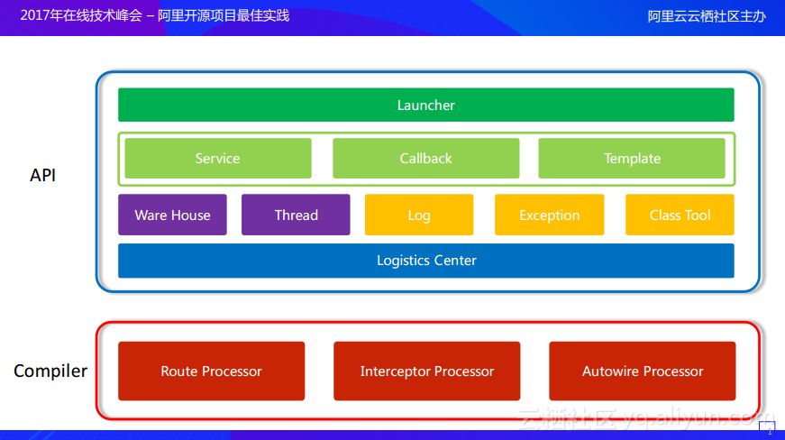

# Arouter源码解析
## Arouter产生缘由
原生路由框架无法解耦，不支持动态跳转，无法降级，难以协调Native与H5间跳转。

## 框架整体结构

ARouter主要由两个SDK组成，Compiler部分用于扫描(@Route, @Interceptor, @Autowire)注解并生成辅助类，它是作用于编译器的。API部分是ARouter的核心，完成页面跳转、服务注册、参数写入等实际逻辑，它是面向运行期的。

## 重要类说明
当项目编译时，会在debug目录下生成以下辅助类：
1. 工程名$$Group$$分组名 【组内的路由清单列表】  (添加了@Router的类都会在这里记录)
2. 工程名$$Root$$$模块名 【组别的清单列表】 (加载了所有的Group信息)
3. 工程名$$Providers$$模块名 【Ioc的动作路由清单列表】  (实现IProvider的类)
4. 工程名$$Interceptors$$模块名 【模块内的拦截器清单列表】  (实现IInterceptor的类)

在ARouter.init()时只会加载2，3，4项，第1项只有使用到某个组的对象时才会一次性加载该组的所有类。

LogisticsCenter
WareHouse：存放路由信息及配置等

## ARouter.init()
ARouter使用了外观模式，其实际对象是_ARouter类，因此该方法调用了_ARouter.init()。
1. 把所有由arouter-compiler生成的辅助类类名找到，并把Group、Provider、Interceptor信息存入WareHouse中
2. 实例化InterceptorService，该service用于轮询用户自定义的拦截器（实例化使用了ARouter.build().navigation()，下文介绍）

## ARouter.navigation(clazz)
该方法是直接根据class<>对象而不是String构造一个provider对象，在源码中比较常见。
1. 交给_ARouter.navigation实际操作
2. 注释1处由LogisticsCenter新建Postcard，但是这时的Postcard仅包含基本的path和group内容
3. 注释2处构造出Provider实例，具体流程见下文

``` java
// _ARouter.java
protected <T> T _ARouter.navigation(Class<? extends T> service) {
    try {
        Postcard postcard = LogisticsCenter.buildProvider(service.getName()); // 1
        ...
        LogisticsCenter.completion(postcard); // 2
        return (T) postcard.getProvider();
    } catch (NoRouteFoundException ex) {
        ...
    }
}
```

## ARouter.build(path).navigation()
1. 同样，该操作会交给_ARouter运行
2. _ARouter.build(path)方法会新建Postcard对象，但是目前该对象仅记录了path和group信息。其他信息需要调用navigation()方法生成。
3. Postcard#navigation会调用_ARouter#navigation，这个方法比较重要，navigation回调、拦截器、降级等操作都在这里完成。
4. 首先在LogisticsCenter去找目标，如果找不到则触发nav回调或者触发降级；如果找到了那么会遍历拦截器，最终交给_navigation
5. 在_ARouter#_navigation中会根据Postcard类型进行执行不同的流程，如果是Activity类型的那么使用Intent跳转，最终调用ActivityCompat.startActivity()；如果是Fragment那么仅new出来并设置参数；如果是provider，那么直接返回。

``` java
// ARouter.java
//一次路由跳转的最终调用函数,包含 查找回调的调用、拦截器处理、绿色通道校验、和具体路由操作
    protected Object _ARouter.navigation(final Context context, final Postcard postcard, final int requestCode, final NavigationCallback callback) {
    try {
        LogisticsCenter.completion(postcard);//【1】完善postcard。当前只有 path和group
    } catch (NoRouteFoundException ex) {
        ...
        if (null != callback) {
            callback.onLost(postcard);//【2】执行到这里，触发查找失败
        } else {   
            DegradeService degradeService = ARouter.getInstance().navigation(DegradeService.class);//【2】执行到这里，使用IOc.byType()的方式 全局降级策略的实现
            if (null != degradeService) {
                degradeService.onLost(context, postcard);
            }
        }
        return null;
    }

    if (null != callback) {//【2】执行到这里，说明找到了路由元信息，触发  路由查找的回调
        callback.onFound(postcard);
    }

    if (!postcard.isGreenChannel()) {//【3】绿色通道校验
        interceptorService.doInterceptions(postcard, new InterceptorCallback() {//调用拦截器截面控制器，遍历内存仓库的自定义拦截器，并在异步线程中执行拦截函数
            /**
                * Continue process
                *
                * @param postcard route meta
                */
            @Override
            public void onContinue(Postcard postcard) {
                _navigation(context, postcard, requestCode, callback);//【4】根据 路由类型执行具体路由操作
            }

            /**
                * Interrupt process, pipeline will be destory when this method called.
                *
                * @param exception Reson of interrupt.
                */
            @Override
            public void onInterrupt(Throwable exception) {
                if (null != callback) {
                    callback.onInterrupt(postcard);
                }
            }
        });
    } else {
        return _navigation(context, postcard, requestCode, callback);//【4】根据 路由类型执行具体路由操作
    }
    return null;
}
```
## LogisticsCenter.completion()
这个方法的出镜率极高，它的作用是把仅包含path和group的Postcard构造出完整的Postcard。并且ARouter宣传的在实际使用中按组加载也可以在这里体现。部分代码如下：
``` java
public synchronized static void completion(Postcard postcard) {
    ...
    RouteMeta routeMeta = Warehouse.routes.get(postcard.getPath());//根据路径URL获取到路径元信息
    if (null == routeMeta) {    // 如果未获取到路径元信息，可能是由于 未加载对应分组的【组内清单列表】 or 的确没有
        Class<? extends IRouteGroup> groupMeta = Warehouse.groupsIndex.get(postcard.getGroup());  // 从【组别的清单列表】拿到对应组的 组内清单创建逻辑
        if (null == groupMeta) {//如果为空，则丢出异常，未找到
            throw new NoRouteFoundException(TAG + "There is no route match the path [" + postcard.getPath() + "], in group [" + postcard.getGroup() + "]");
        } else {
            
            IRouteGroup iGroupInstance = groupMeta.getConstructor().newInstance();//实例化【组内清单创建逻辑】
            iGroupInstance.loadInto(Warehouse.routes);//将该组的【组内清单列表】加入到内存仓库中
            Warehouse.groupsIndex.remove(postcard.getGroup());//从【组别的清单列表】移除当前组
            completion(postcard);   // Reload 再次触发完善逻辑
        }
    } else {
        postcard.setDestination(routeMeta.getDestination());//【3】目标 class
        postcard.setType(routeMeta.getType());//【4】路由类型
        postcard.setPriority(routeMeta.getPriority());//【5】路由优先级
        postcard.setExtra(routeMeta.getExtra());//【6】额外的配置开关信息

        // 以下只有build(uri)时才有用
        Uri rawUri = postcard.getUri();
        if (null != rawUri) {   // 【7】如果有URI，则根据路由元信息的“目标Class的需要注入的参数 的参数名称：参数类型TypeKind  paramsType”和“URI的?参数”进行赋值
            Map<String, String> resultMap = TextUtils.splitQueryParameters(rawUri);//“URI的?参数”
            Map<String, Integer> paramsType = routeMeta.getParamsType();//“目标Class的需要注入的参数 的参数名称：参数类型TypeKind ”

            if (MapUtils.isNotEmpty(paramsType)) {
                // Set value by its type, just for params which annotation by @Param
                for (Map.Entry<String, Integer> params : paramsType.entrySet()) {//目标Class的需要注入的参数 的参数名称：参数类型TypeKind”，向postcard的bundle中put对应的携带数据
                    setValue(postcard,
                            params.getValue(),//参数类型TypeKind
                            params.getKey(),//参数名称
                            resultMap.get(params.getKey()));//参数值
                }

                // 在bundle存入字符数组 wmHzgD4lOj5o4241：待注入参数列表
                postcard.getExtras().putStringArray(ARouter.AUTO_INJECT, paramsType.keySet().toArray(new String[]{}));
            }

            // Save raw uri 在bundle存入字符串 NTeRQWvye18AkPd6G：Uri
            postcard.withString(ARouter.RAW_URI, rawUri.toString());
        }

        switch (routeMeta.getType()) {
            case PROVIDER:  // if the route is provider, should find its instance 【8】PROVIDER类型的路由则实现 实例化目标类 + 绿色通道(byType方式的核心实现)
                // Its provider, so it must be implememt IProvider
                Class<? extends IProvider> providerMeta = (Class<? extends IProvider>) routeMeta.getDestination();//目标 class
                IProvider instance = Warehouse.providers.get(providerMeta);//目标class的实例对象是否已经存在了
                if (null == instance) { // There's no instance of this provider  如果存在了就直接使用，不存在才创建新的？ TODO Ioc导致全局共享一个对象？
                    IProvider provider;
                    try {
                        provider = providerMeta.getConstructor().newInstance();
                        provider.init(mContext);
                        Warehouse.providers.put(providerMeta, provider);
                        instance = provider;
                    } catch (Exception e) {
                        throw new HandlerException("Init provider failed! " + e.getMessage());
                    }
                }
                postcard.setProvider(instance);//【8.1 实例化并持有目标类】
                postcard.greenChannel();    //【8.2 绿色通道】 Provider should skip all of interceptors
                break;
            case FRAGMENT:
                postcard.greenChannel();    // Fragment needn't interceptors  【9】如果是Fragment则设置绿色通道
            default:
                break;
        }
    }
}
```

1. 现在WareHouse中找是否能找到对应path的RouteMeta信息。（RouteMeta信息包含了实现类、路由路径、组、参数等信息），如果没有找到可能是该组还没有加载或者本身路径有误
2. 若未找到，那么在Warehouse中根据group信息去找，如果找到了那么将组内所有的路由加入Warehouse中，并删除该group，如果仍旧找不到说明路径有误。
3. 接1，如果根据path找到了RouteMeta，那么把信息设置给Postcard
4. 如果path是uri类型的那么需要解析出参数，并写入Postcard
5. 如果是Activity或Fragment类型，那么直接可以返回，因为对应的类信息已经写在Postcard.destination了
6. 如果是Provider类型，那么从Warehouse中找，如果找不到则新建（因此可以看到Provider实际是单例的），并设置入Postcard

## ARouter.inject()
1. 依旧交给_ARouter.inject()执行，内部再交给AutowiredService
2. 该类又会调用事先compiler的类：类名$$Arouter$$Autowire，然后在inject()方法中手动设置成员属性，完成autowire工作


## 参考资料
1. [阿里开源路由框架ARouter的源码分析](https://juejin.im/entry/59ef1d0c51882578da0d0ea8)