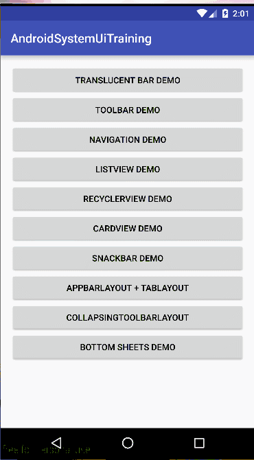

# Listview与Recyclerview对比分析

## 目录

## 基础使用对比
### **ListView**
- 继承重写 BaseAdapter 类
- 自定义 ViewHolder 和 convertView 一起完成复用优化工作

### **RecyclerView**
- 继承重写 RecyclerView.Adapter 和 RecyclerView.ViewHolder
- 设置布局管理器，控制布局效果

### 示例代码
```java
// 第一步：继承重写 RecyclerView.Adapter 和 RecyclerView.ViewHolder
public class AuthorRecyclerAdapter extends RecyclerView.Adapter<AuthorRecyclerAdapter.AuthorViewHolder> {

    ...

    @Override
    public AuthorViewHolder onCreateViewHolder(ViewGroup parent, int viewType) {
        ...
        return viewHolder;
    }

    @Override
    public void onBindViewHolder(AuthorViewHolder holder, int position) {
        ...
    }

    @Override
    public int getItemCount() {
        if (mData == null) {
            return 0;
        }
        return mData.size();
    }

    class AuthorViewHolder extends RecyclerView.ViewHolder {
        ...
        public AuthorViewHolder(View itemView) {
            super(itemView);
            ...
        }
    }
}
mRecyclerView = (RecyclerView) findViewById(R.id.recycler_view);
mRecyclerAdapter = new AuthorRecyclerAdapter(mData);

// 第二步：设置布局管理器，控制布局效果
LinearLayoutManager linearLayoutManager = new LinearLayoutManager(RecyclerDemoActivity.this);
linearLayoutManager.setOrientation(LinearLayoutManager.VERTICAL);
mRecyclerView.setLayoutManager(linearLayoutManager);
mRecyclerView.setAdapter(mRecyclerAdapter);
```

## 空数据处理
### **ListView**
提供了 `setEmptyView` 这个 API 来让我们处理 `Adapter` 中数据为空的情况。示例代码：
```java
    mListView = (ListView) findViewById(R.id.listview);
    mListView.setEmptyView(findViewById(R.id.empty_layout));//设置内容为空时显示的视图
```
### **RecyclerView**
只能自己手动实现。例如在有数据是显示RecyclerView，无数据隐藏该View并显示一张空数据图片。

## HeaderView和FooterView
### **ListView**
提供系统api`addFooterView(View v)`和`addHeaderView(View v)`设置。
### **RecyclerView**
没有提供相关api，比较容易的解决方法是在Adapter中提供三种类型（Header，Footer以及普通Item）的 Type 和 View，但是这种方法写起来很麻烦。另外一种思路是用装饰者模式扩充Adapter功能，详见[张鸿洋博客](https://blog.csdn.net/lmj623565791/article/details/51854533)

## 局部刷新
### **ListView**
更新ListView的数据源后，通过Adapter的notifyDataSetChanged通知视图更新。好处是比较简单，坏处是它会重绘每个Item。因此局部更新推荐手动调用`adapter.getView()`方法，示例代码：
```java
    public void updateItemView(ListView listView, int position) {
        //换算成 Item View 在 ViewGroup 中的 index
        int index = position - listView.getFirstVisiblePosition();
        if (index >= 0 && index < listView.getChildCount()) {
            //更新数据
            Fruit fruit = mFruitList.get(position);
            fruit.setName("Pear");
            fruit.setImageId(R.drawable.pear_pic);
            //更新单个Item
            View itemView = listView.getChildAt(index);
            getView(position, itemView, listView);
        }
    }
```
### **RecyclerView**
RecyclerView.Adapter提供了notifyItemChanged 用于更新单个视图。示例代码：
```java
    mFruitList.get(changePos).setName("Watermelon");
    mFruitList.get(changePos).setImageId(R.drawable.watermelon_pic);
    mFruitAdapter.notifyItemChanged(changePos++);
```

## 动画效果
### **ListView**
只能自己通过属性动画来操作 Item 的视图。 Github 也有很多封装得好好的开源库给我们用，如：[ListViewAnimations](https://link.jianshu.com/?t=https://github.com/nhaarman/ListViewAnimations) 就封装了大量的效果。
### **RecyclerView**
RecyclerView 为我们提供了很多基本的动画 API ，如增删移改。若觉得系统提供的并不能满足需求，也可以通过相应接口实现自己的动画效果，继承 RecyclerView.ItemAnimator 类，并实现相应的方法，再调用 RecyclerView 的 setItemAnimator(RecyclerView.ItemAnimator animator) 方法设置完即可实现自定义的动画效果。当然也有RecyclerView 开源的动画库：(recyclerview-animators)[https://github.com/wasabeef/recyclerview-animators]。

## 监听item事件
### **ListView**
ListView 为我们准备了几个专门用于监听 Item 的回调接口，如单击、长按、选中某个 Item 等。
``` java
void setOnItemClickListener(AdapterView.OnItemClickListener listener);
void setOnItemLongClickListener(AdapterView.OnItemLongClickListener listener);
void setOnItemSelectedListener(AdapterView.OnItemSelectedListener listener);
```
值得注意的是`AdapterView.OnItemClickListener#onItemClick(AdapterView<?> adapterView, View view, int position, long id)`的position参数会计算HeaderView。因此比较好的方法是使用id作为位置的参数，使用id需要改写adapter的方法，如下。如果是HeaderView或者FooterView，id返回为-1。
```java
// Adapter
public long getItemId(int position) {
    return position;
}
```
### **RecyclerView**
只提供了方法`addOnItemTouchListener`，不过需要自己判断手势操作。所以一般的做法是在`RecyclerView.Adapter#onBindViewHolder(viewHolder, position)`中对每个view单独设置`OnClickListener`。

## 嵌套滚动机制
熟悉 Android 触摸事件分发机制的童鞋肯定知道，Touch 事件在进行分发的时候，由父 View 向它的子 View 传递，一旦某个子 View 开始接收进行处理，那么接下来所有事件都将由这个 View 来进行处理，它的 ViewGroup 将不会再接收到这些事件，直到下一次手指按下。而嵌套滚动机制（NestedScrolling）就是为了弥补这一机制的不足，为了让子 View 能和父 View 同时处理一个 Touch 事件。


一开始上面一大块区域就是 CollapsingToolbarLayout ，下方的列表是 RecyclerView ，当然 RecyclerView 向上滑动时，CollapsingToolbarLayout 能够同时网上收缩，直到只剩下顶部的 Toolbar。之所以能够实现这种效果，就是完全依赖于嵌套滚动机制，如果没有这套机制，按照原有的触摸事件分发逻辑， RecyclerView 内部已经把 Touch 事件消耗掉了，完全无法引起顶部的 CollapsingToolbarLayout 产生联动收缩的效果。

如果在其他代码布局都不变的情况下，我们把 RecyclerView 替换成 ListView ，则无法产生上面图中的动态效果，因为 ListView 并不支持嵌套滚动机制，事件在 ListView 内部已经被消耗且无法传递出来，大家可以自行尝试验证一下

## 应该根据场景选择
列表页展示界面，需要支持动画，或者频繁更新，局部刷新，建议使用RecyclerView，更加强大完善，易扩展；其它情况(如微信卡包列表页)两者都OK，但ListView在使用上会更加方便，快捷。


## 参考资料
1. https://www.jianshu.com/p/f592f3715ae2
2. http://blog.qiji.tech/archives/16436
以下是缓存相关内容
3. https://zhuanlan.zhihu.com/p/24807254
4. https://cloud.tencent.com/developer/article/1005658


