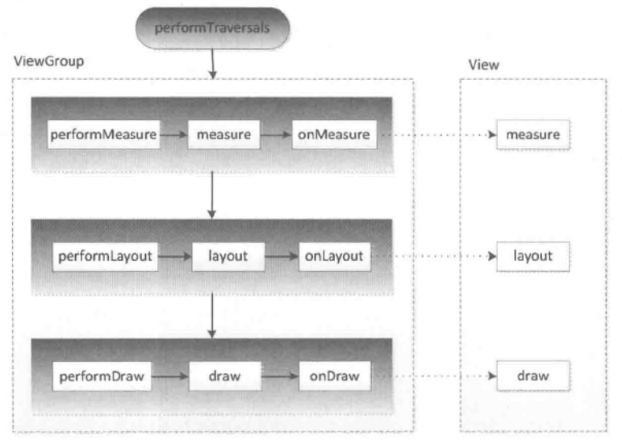

# view工作原理

----------

## 目录

## 
View的绘制流程是从`ViewRoot.performTraversals()`方法开始的，经过`measure(), layout(), draw()`三个过程才能最终将一个View绘制出来。详见以下图片。

measure过程决定了View的宽/高，Measure完成后，可以通过`getMeasureWidth(), getMeasureHeight()`获取View测量后的宽和高。