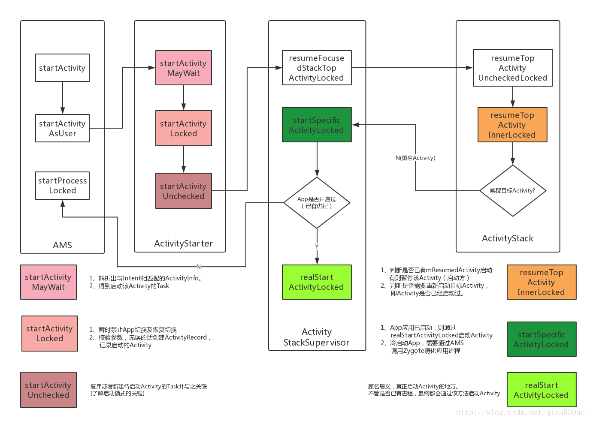

# View事件体系简述

## framework相关

### 简述app启动流程
由launcher发起startActivity操作，内部通过Instrumentation启动activity，之后跨进程调用ams的startActivity，之后又经过ActivityStarter/ActivityStackSupervisor/ActivityStack等，然后会检查app是否已有进程，没有的话AMS会开启新线程并指定ActivityThread的main方法。在main中会开启looper，之后又跨进程调用ams执行attachApplication。由AMS通过applicationThread指挥activitythread完成创建application和创建activity的工作，这期间也会依次调用它们的生命周期，最后在handleResume中把所有界面绘制到屏幕上。

### 简述view事件体系

### 简述View的绘制流程

### 简述handler机制

### 简述binder和aidl
binder是android中最常用的一种ipc方式，例如android四大组件、AMS等系统服务就用到了binder。跨进程通信在linux中有多种方式，例如管道、消息队列、共享内存等，但是传统ipc性能较低并且安全性较差因此android使用了一种全新的ipc方式：binder。
通信时，client进程请求一个binder对象时，驱动会给它一个代理对象而不是真实对象，client所有的操作都是由这个代理对象处理的，代理对象拿到数据后也不会真的做计算，而是把参数打包，由binder驱动转交给server进程并真正执行。完成后再打包传给代理对象。

## 性能优化相关
### 常见性能优化方法

### 简述ArrayMap和SparseArray，它和Hashmap相比有何优势？
SparseArray是一种仅支持key类型为int的map。它的内部有两个数组，一个数组存放的是int类型的key，另一个数组存放Object类型的value。同一组<key, value>在两个数组中存放的下标相同，而int数组中的key以升序存放，因此查找时可以先通过二分查找int数组找到下标，从而找到value。它的优势有两点：1.由于它没有继承自Map接口，因此int类型不需要自动装箱；2.它必须在数组全满时才扩容，因此使用效率会比较高。但是代价在于1. 查找的复杂度是logn，当元素变多后查找时间会变多；2.由于要保持key数组升序，因此加入一个新key可能会引起全部后面的元素都要往后移动一位；3.相比于ArrayMap每次删除元素时不需要都把整个数组迁移，但是删除元素过多时还需要做清理工作。 

ArrayMap是普通的map，和hashmap相比它内部存储结构不同。它内部有两个数组，第一个数组用于存放key的hash值，第二个数组以相邻两个位置为一组存放key和value，因此第二个数组的大小是第一个的两倍。hash数组是升序存放的，因此可以通过二分查找key的hash来找到对应的value。它的优势在于：1.它的空间使用效率非常高，它不仅在空间满时才会扩容，并且当使用率小于三分之一时还会主动降容。缺点在于：1. 查找的复杂度是O(logn)，而hashmap是O(1)；2.不论是插入还是删除都需要把后面的所有元素都移动。

### Webview如何优化

## 第三方框架
### Arouter

## java基础

### Hashmap原理

### ConcurrentHashmap原理

## 项目相关

### 项目中遇到的最大问题及如何解决

## 个人相关
### 最近一份工作的收获与成长

### 未来规划

