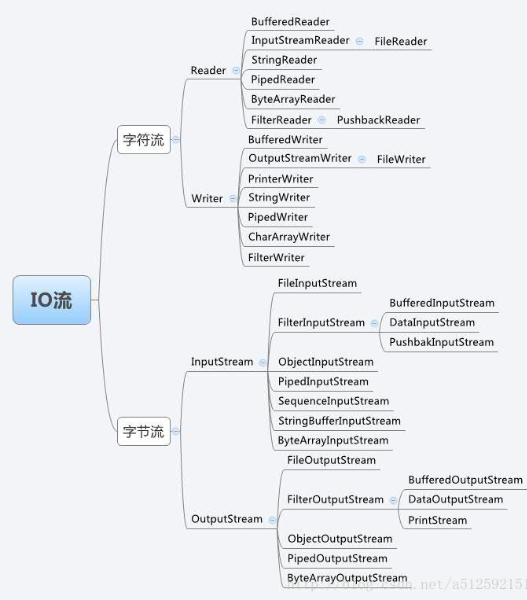

# java IO
----------------

## 目录

## IO流

流是一组有顺序的，有起点和终点的字节集合，是对数据传输的总称或抽象。 流的本质是数据传输， 根据数据传输特性将流抽象为各种类， 方便更直观的进行数据操作。

## IO流分类
### 1.输入流和输出流
### 2.字节流和字符流
字节流和字符流的区别：
1. 读写单位不同：字节流以字节(8bit) 为单位，字符流以字符为单位，根据码表映射字符，一次可能读多个字节。
2. 处理对象不同：字节流能处理所有类型的数据(如图片、 avi等) ，而字符流只能处理字符类型的数据。

只要是处理纯文本数据， 就优先考虑使用字符流。 除此之外都使用字节流。

## IO流的四大基类

